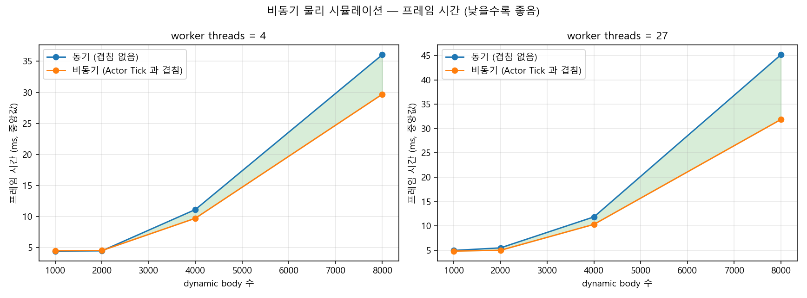
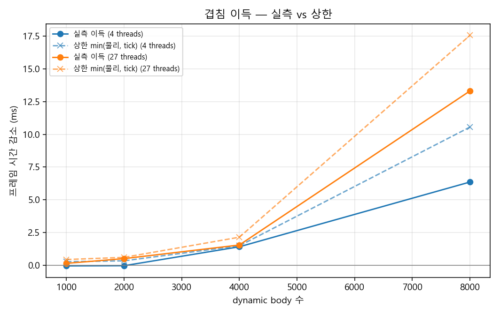

# 비동기 물리 시뮬레이션 — 프로파일링

PhysX 시뮬레이션을 비동기로 돌려 Actor Tick 과 겹치게 한 변경의 효과를 측정한 결과입니다.
설계는 [PhysicsMultithread.md](PhysicsMultithread.md) 에 있습니다.

## 측정 대상

`simulate()` 호출 후 `fetchResults()` 를 즉시 부르지 않고 Actor Tick 뒤로 미루는 변경입니다.
두 커밋이 한 쌍입니다.

| 커밋 | 내용 |
|---|---|
| [`5292ec1c`](https://github.com/nansu0425/GameTechLab-WEEK13-public/commit/5292ec1c) | `FPhysSceneImpl` 에 비동기 경로 추가. `simulate()` 와 `fetchResults()` 분리 |
| [`0e1ad224`](https://github.com/nansu0425/GameTechLab-WEEK13-public/commit/0e1ad224) | `UWorld::Tick` 에서 `EndFrame()` 을 Actor Tick 뒤로 이동 |

[`5292ec1c`](https://github.com/nansu0425/GameTechLab-WEEK13-public/commit/5292ec1c) 단독으로는 이득이 없습니다. 그 시점에는 `StartFrame()` 에서 결과를 수집했고
`UWorld::Tick` 이 `StartFrame`·`Tick`·`EndFrame` 을 연달아 호출해 겹칠 구간이 없었습니다.
[`0e1ad224`](https://github.com/nansu0425/GameTechLab-WEEK13-public/commit/0e1ad224) 가 `EndFrame()` 을 Actor Tick 뒤로 옮기면서 겹침이 생깁니다.

현재 코드에서 겹치는 구간은 `UWorld::Tick` 의 Actor 순회부터 `CollisionManager::UpdateCollisions()`
까지입니다 (`World.cpp:296~339`).

## 측정 방법

### A/B 방식

과거 커밋을 checkout 하지 않고, 현재 코드의 `FPhysSceneImpl::bAsyncSimulation`
(`PhysSceneImpl.h:110`) 을 토글해 비교했습니다. 이 플래그가 `false` 면
`simulate()` 와 `fetchResults()` 가 `PhysScene->Tick()` 안에서 연달아 실행되고
(`PhysScene.cpp:574~`), Actor Tick 은 물리가 끝난 뒤에 돕니다. [`5292ec1c`](https://github.com/nansu0425/GameTechLab-WEEK13-public/commit/5292ec1c) 이전의 실행
순서와 같은 코드 경로입니다.

과거 커밋을 쓰지 않은 이유는 계측 수단이 나중에 들어왔기 때문입니다.
`stat physics`(`92ee6c58`) 는 [`5292ec1c`](https://github.com/nansu0425/GameTechLab-WEEK13-public/commit/5292ec1c)·[`0e1ad224`](https://github.com/nansu0425/GameTechLab-WEEK13-public/commit/0e1ad224) 보다 뒤이고,
그 시점을 checkout 하면 `Simulate`/`Fetch` 시간을 뽑을 수단이 없습니다.

> 이 A/B 는 코드 경로가 같다는 근거에 기반합니다. 두 커밋을 실제로 checkout 해서
> 대조한 것이 아닙니다.

### 하네스

`FPhysBench`(`Physics/PhysBench.h`, `PhysBench.cpp`) 가 config 큐를 순서대로 실행합니다.
1 run = PIE 진입 → 바디 스폰 → warmup → 프레임 기록 → PIE 종료입니다.
`PhysScene` 은 PIE 진입마다 새로 만들어지므로(`World.cpp:381`), 스레드 수와 비동기 여부를
빌드 1회로 스윕할 수 있습니다.

- **씬**: 바닥 1개 위에 `APhysBoxActor` 를 정육면체 격자로 스폰해 떨어뜨립니다.
  각 액터의 `Tick` 은 바디 transform 을 읽어 메시에 반영합니다 — 이게 겹침 대상 작업입니다.
- **sleep 비활성화**: 스폰 시 `setSleepThreshold(0)`. 그대로 두면 바디가 잠들며
  active 수가 시간에 따라 줄어 워크로드가 계속 달라집니다.
- **메시 숨김**: 스폰한 메시는 `SetVisibility(false)`. 8000 body 에서 렌더가 프레임을 지배해
  물리 측정이 묻힙니다. 따라서 여기의 프레임 시간에 렌더 비용은 들어 있지 않습니다.
- **CSV**: run 이 끝날 때마다 append. 프레임마다 쓰면 그 I/O 가 측정 대상에 섞입니다.

실행은 커맨드라인으로 합니다.

```
Mundi.exe "-physbench=axis2 -repeat=3 -bodies=8000 -csv=axis2_8000.csv"
python Tools/PhysBench/analyze_axis2.py <csv...> -o <출력 디렉터리>
```

### 환경

- i7-14700HX (P-core 8 + E-core 12, 논리 28), RAM 32 GB
- Release x64
- VSync off — `D3D11RHI.cpp:541` 이 `Present(0, 0)` (sync interval 0)
- `FixedTimestep = 1/60`, `MaxSubsteps = 8` (`PhysSceneImpl.h:129,132`)
- body 수 1000 / 2000 / 4000 / 8000 × worker thread 4 / 27 × 동기·비동기, 각 3회 반복
- run 당 warmup 150 프레임 + 기록 400 프레임

### 집계

- 프레임 시간은 **중앙값**. 스파이크에 끌리지 않게.
- 물리·Actor Tick 시간은 **프레임당 평균**. 고정 timestep 이라 물리 스텝이 없는 프레임이
  섞이고, 프레임 시간 감소폭을 예측하려면 그 0 프레임까지 포함해야 합니다.
- 대표값은 **이득 %**. 절대 시간에 회차 드리프트가 있습니다(아래 「한계」).
- `active` 가 목표 body 수의 95% 미만인 프레임은 제외합니다.

## 결과

| bodies | threads | 동기 ms | 비동기 ms | 이득 % | 회차별 이득 % | 이득 ms |
|---:|---:|---:|---:|---:|---|---:|
| 1000 | 4 | 4.46 | 4.52 | −3.5% | −26.7 ~ +29.8 | −0.06 |
| 2000 | 4 | 4.50 | 4.55 | −1.0% | −4.3 ~ +6.3 | −0.04 |
| 4000 | 4 | 11.15 | 9.74 | **+12.4%** | +10.8 ~ +12.7 | +1.40 |
| 8000 | 4 | 36.05 | 29.70 | **+17.6%** | +17.6 ~ +17.9 | +6.35 |
| 1000 | 27 | 4.95 | 4.81 | +2.8% | −10.8 ~ +14.0 | +0.14 |
| 2000 | 27 | 5.47 | 4.97 | +5.9% | −29.7 ~ +13.7 | +0.50 |
| 4000 | 27 | 11.85 | 10.31 | **+13.0%** | +12.8 ~ +13.0 | +1.54 |
| 8000 | 27 | 45.20 | 31.88 | **+24.8%** | +22.2 ~ +29.5 | +13.32 |



**8000 body / 4 스레드에서 프레임 시간 17.6% 감소**가 대표 수치입니다. 3회가 0.3%p 안에
들어옵니다. 4000 도 범위가 2%p 안입니다.

1000~2000 body 에서는 이득이 없습니다. 회차별 범위가 0 을 크게 걸칩니다. 숨길 물리 작업이
프레임당 0.3~0.6ms 뿐이라 예상되는 결과입니다.

집계값 전체는 [`PhysBench/axis2_summary.csv`](PhysBench/axis2_summary.csv),
원본 프레임 기록은 [`PhysBench/raw/`](PhysBench/raw/) 에 있습니다.

## 이득의 상한

겹침으로 줄일 수 있는 시간은 **`min(물리 시간, Actor Tick 시간)`** 을 넘지 못합니다.
둘 중 짧은 쪽이 끝나면 겹칠 것이 없습니다.



측정한 이득이 이 상한을 한 번도 넘지 않고 그 아래를 따라갑니다. 8000 body / 4 스레드에서
물리 10.55ms, Actor Tick 18.02ms, 상한 10.55ms, 실측 6.35ms 입니다.
겹침이 실제로 일어나고 있다는 직접적인 근거이자, 동시에 한계이기도 합니다 —
**Actor Tick 이 가벼운 씬에서는 이득도 그만큼 작습니다.**

이 벤치의 Actor Tick 비용은 `APhysBoxActor::Tick` 이 `FBodyInstance::GetWorldTransform()` 을
부르는 데서 나옵니다. 이 함수는 바디마다 PhysX scene read lock 을 잡습니다
(`BodyInstance.cpp:298~`). 8000 바디에서 18ms 입니다.

## 겹침이 블록되지 않는 이유

비동기 모드에서 Actor Tick 은 시뮬레이션이 진행 중일 때 `getGlobalPose()` 를 읽습니다.
`Simulate()` 가 잡는 write lock 은 `simulate()` 반환 직후 스코프가 끝나며 풀리고
(`PhysScene.cpp:509~522`), `simulate()` 는 비블로킹이므로 그 시점에 시뮬레이션은 아직 진행 중입니다.
따라서 read lock 이 막히지 않고 겹침이 성립합니다.

그 대가로 **이 프레임의 Actor Tick 이 읽는 pose 는 직전 스텝의 값**입니다. 렌더에 반영되는
transform 은 `FetchResults()` 의 `UpdateRenderInterpolation()` 이 다시 씁니다.

씬은 `eREQUIRE_RW_LOCK` 없이 생성됩니다(`PhysScene.cpp:404~406`).

## 한계

- **절대 프레임 시간에 회차 드리프트가 있습니다.** 8000 body 에서 같은 설정이 회차를
  거듭할수록 33.2 → 36.1 → 40.8ms 로 올라갑니다(+23%). 노트북 CPU 의 전력·발열로 보이며
  확인하지 않았습니다. 동기·비동기를 같은 회차 안에서 붙여 측정해 드리프트가 양쪽에
  같이 실리므로 **비율은 안정적**입니다. 절대 ms 는 재현되지 않습니다.
- **12000 body 는 제외했습니다.** 세 가지가 겹칩니다 — 동기 모드가 `MaxSubsteps = 8`
  상한에 닿아 물리가 실시간을 따라가지 못하고(두 모드가 시뮬레이션한 시간 자체가 달라집니다),
  12 run 중 6번째에서 엔진이 크래시했고, 드리프트가 75 → 136ms 로 심합니다.
  원본은 `PhysBench/raw/axis2_12000.csv` 에 남겨뒀습니다. 크래시 원인은 확인하지 않았습니다.
- **렌더 비용이 빠진 수치입니다.** 스폰한 메시를 숨기고 측정했습니다.
- **워크로드가 한 종류입니다.** 바닥에 쌓인 box 더미입니다. ragdoll 이나 흩어진 바디는
  contact island 구조가 달라 결과가 다를 수 있습니다.
- **27 스레드의 24.8% 를 대표 수치로 쓰면 안 됩니다.** 동기 기준선(45.20ms)이 나빠서 커진
  값입니다. 비동기끼리 비교하면 4 스레드가 모든 body 수에서 27 스레드보다 빠릅니다
  (8000 에서 29.70 vs 31.88). `FPhysSceneImpl::CalculateOptimalThreadCount()` 는 이 머신에서
  27 을 고르는데, 그 값이 최적이 아닙니다. 스레드 수 자체의 스윕은 이 문서의 범위 밖입니다.

## 재현

1. Release x64 빌드
2. `Binaries/Release/` 에서 body 수마다 프로세스를 나눠 실행
   ```
   Mundi.exe "-physbench=axis2 -repeat=3 -bodies=1000 -csv=axis2_1000.csv"
   Mundi.exe "-physbench=axis2 -repeat=3 -bodies=2000 -csv=axis2_2000.csv"
   Mundi.exe "-physbench=axis2 -repeat=3 -bodies=4000 -csv=axis2_4000.csv"
   Mundi.exe "-physbench=axis2 -repeat=3 -bodies=8000 -csv=axis2_8000.csv"
   ```
3. `python Tools/PhysBench/analyze_axis2.py axis2_*.csv -o <출력 디렉터리>`

에디터 안에서는 `PHYSBENCH AXIS1|AXIS2` · `PHYSBENCH RUN [csv]` · `PHYSBENCH STATUS` ·
`PHYSBENCH ABORT` 콘솔 명령으로도 실행됩니다.
